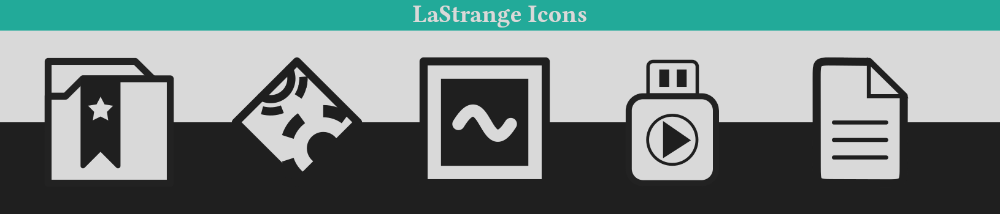

# LaStrange icons

A clean, simple icon theme for easy and focused computing.
Originally developed for [dogfooding](https://en.wikipedia.org/wiki/Eating_your_own_dog_food), the name is a reference to Tom LaStrange, the inventor of [the TWM window manager](https://en.wikipedia.org/wiki/Twm), which served as the main inspiration for the desktop theme.

# Philosophy

## Do One Thing And Do It Well

This theme being tailor-made for Linux (notably the XFCE desktop environment), it's design is naturally influenced by the Unix philosophy.
Everything is designed according to a set of simple, predefined rules (outlined below), which are to be applied thoroughly, consistently and automatically across the entire system, such that the user's cognitive load is reduced by associative consistency. In short: Things that work similar, look similar, are similar.

## No Frills, No Distractions, No Secrets

Most modern UI designs attempt to simplify the user experience by hiding or obfuscating less important features. Especially in flat designs this tends to lead to confusion about what is interactible, in which way and how the UI is organized.

Beyond that many modern UI designs also employ so called "calls to action". In practice, this usually means that elements the designer deems important are emphasized by making them attention-grabbing, which can be distracting as well as allow for [dark patterns](https://en.wikipedia.org/wiki/Dark_pattern).

LaStrange does not impose any particular order of importance to an action. Instead, everything is distilled to it's essential function and presented equally, which leads to a clean, consistent and uncluttered experience for users who know what they want their system to do.

## Let The Computer Do The Work

Wherever possible, everything is rendered on-the-fly, **without** the use of any pre-built assets (due to restrictions this currently only applies to the GTK theme). This reduces labour effort, keeps consistency and is better scalable to increasing display resolutions/pixel densities. In case of the [LaStrange icon theme](https://github.com/zibonbadi/lastrange-icons/), this means that *everything* will be built upon vector graphics.

## You Are Not Alone

Every design exists within a context. Thus, it is not enough for a UI-design to be internally consistent; it has to conform to the UI/UX guidelines of it's context as well to ensure a pleasant, consistent user experience.
[LaStrange Desktop theme]( https://github.com/zibonbadi/lastrange-icons )

# Practice

